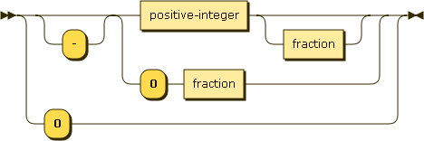
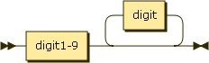
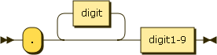
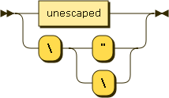

# Son

A subset of JSON.

JSON contains lots of extraneous details like the difference between `10e2` and `10E2`. This helps when writing it by hand, but can cause problems such as making it difficult to serialize and hash consistently.

Son is a subset of JSON intended to remove redundant options. It's a useful tool for services trying to follow [Postel's Law](https://en.wikipedia.org/wiki/Jon_Postel#Postel.27s_law) -- they can accept normal JSON for flexibility and output Son for consistency.

## Number

#### positive-integer:

#### fraction:

## String

#### char:

The railroad diagrams for Objects, Arrays, Bools and Null are left out because they're unchanged from the original.

# Status

Extremely WIP.

# Specification

The formal part of its specification is [here](son.ebnf).

Additionally: object keys must be unique. Object members must be sorted by lexicographic order of their keys.

# Changes from JSON

+ No insignificant whitespace
+ No unnecessary escape sequences
+ No exponential notation
+ No trailing zeros in fractions
+ No negative zero
+ No positive sign

# Differences between this and related projects

See [here](https://housejeffries.com/page/7).

# Notes

+ The diagrams were generated by [this site](http://www.bottlecaps.de/rr/ui), version v1.45.1338.

+ `./vendored/rfc7159.txt` is from [here](https://tools.ietf.org/rfc/rfc7159.txt).
