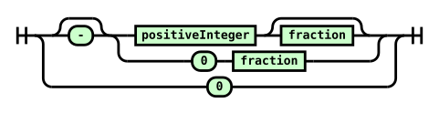
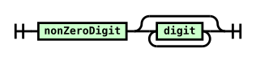
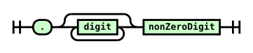
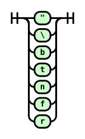

# Son

A subset of JSON.

JSON contains redundant syntax such as allowing both `10e2` and `10E2`. This helps when writing it by hand but isn't good for machine-to-machine communication. Piping JSON through multiple programs creates lots of trivial changes, which makes it hard to do things like take meaningful diffs.

Son is a subset of JSON without redundant options. It's intended for machine-to-machine communication by programs that want to follow [Postel's Law](https://tools.ietf.org/html/rfc761#section-2.10) -- they can accept normal JSON for flexibility and output Son for consistency.

## Son Numbers

+ No exponential notation
+ No trailing zeros in fractions
+ No negative zero
+ No positive sign

### positiveInteger:

### fraction:

## Son Strings

+ No unnecessary escape sequences

JSON doesn't allow Unicode characters below codepoint x20 or unescaped `"` and `\` in strings. To allow these to still be encoded in JSON we've had to keep a few escape sequences. We use two-character escape sequences (e.g. `\n`) when available, and six-character ones (e.g. `\u0001`) when not.

### shortcutEscape:

## Other Changes from JSON

+ No insignificant whitespace

# Status

Unreleased. Like JSON, the intention is that once Son is released it will never change.

# Specification

The formal part of its specification is [./son.ebnf](./son.ebnf). It uses the EBNF notation described [here](https://www.w3.org/TR/2004/REC-xml11-20040204/#sec-notation).

Additionally: object keys must be unique. Object members must be sorted by lexicographic order of their keys.

# Implementations

+ Haskell reference implementation: [./implementation](./implementation).

# Differences between this and related projects

See [here](https://housejeffries.com/page/7).

# Notes

+ The diagrams were generated with [GrammKit](https://github.com/dundalek/GrammKit).

+ `./vendored/rfc7159.txt` is from [here](https://tools.ietf.org/rfc/rfc7159.txt).
