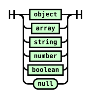
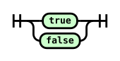
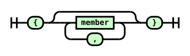
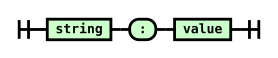
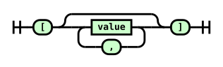
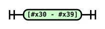
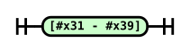
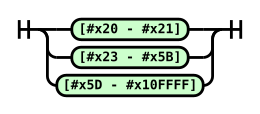
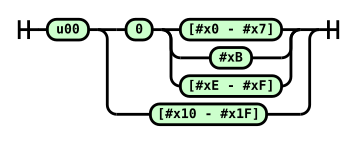

# son.ebnf

## value

Used by: [member](#member), [array](#array)
References: [object](#object), [array](#array), [string](#string), [number](#number), [boolean](#boolean)

## boolean

Used by: [value](#value)

## object

Used by: [value](#value)
References: [member](#member)

## member

Used by: [object](#object)
References: [string](#string), [value](#value)

## array

Used by: [value](#value)
References: [value](#value)

## number

Used by: [value](#value)
References: [positiveInteger](#positiveInteger), [fraction](#fraction)

## fraction

Used by: [number](#number)
References: [digit](#digit), [nonZeroDigit](#nonZeroDigit)

## positiveInteger

Used by: [number](#number)
References: [nonZeroDigit](#nonZeroDigit), [digit](#digit)

## digit

Used by: [fraction](#fraction), [positiveInteger](#positiveInteger)

## nonZeroDigit

Used by: [fraction](#fraction), [positiveInteger](#positiveInteger)

## string

Used by: [value](#value), [member](#member)
References: [unescaped](#unescaped), [shortcutEscape](#shortcutEscape), [codepointEscape](#codepointEscape)

## unescaped

Used by: [string](#string)

## shortcutEscape

Used by: [string](#string)

## codepointEscape

Used by: [string](#string)
